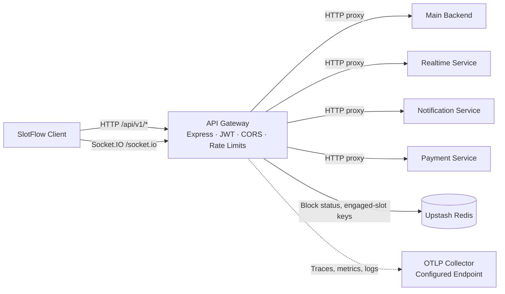

 <div align="center">

# SlotFlow API Gateway

### One entry point. Multiple services.

A TypeScript and Express gateway for routing SlotFlow API traffic, validating access tokens, and proxying Socket.IO connections to backend services.


---

### Live link & Repositories

<a href="https://slotflow.online">
  
</a>
<a href="https://github.com/slotflow">
  
</a>

### Technology Stack


</div>

---

## Overview

The API Gateway is the client-facing entry point for SlotFlow's backend services. It accepts API requests under `/api`, applies gateway-level middleware, and forwards service-specific traffic to configured backend URLs. It also handles the `/socket.io` path for the realtime service.

The frontend communicates with backend services through the gateway rather than addressing each service directly. The gateway verifies JWTs for protected API routes, propagates authenticated user details to downstream services in `x-user-*` headers, applies request limits, and routes realtime traffic separately from ordinary HTTP requests.

The gateway provides centralized routing and middleware, while business logic, payment processing, realtime message handling, and notification delivery are handled by their respective downstream services.

## Core Features

### HTTP Routing and Proxying

- Mounts versioned APIs under `/api/v1`.
- Rewrites gateway paths to downstream `/api/v1/...` paths.
- Routes core application APIs to the configured main backend, with separate targets for payment, notification, and realtime APIs.

### Socket.IO and WebSocket Proxying

- Proxies HTTP polling and WebSocket upgrade traffic matching `/socket.io` to the configured realtime service.
- Enables WebSocket proxying and performs token validation during WebSocket upgrades.

### Authentication and Access Boundaries

- Accepts a JWT from the `token` cookie, a `Bearer` authorization header, or a `token` query parameter.
- Verifies tokens with the configured `JWT_SECRET` and attaches the decoded user identity to the Express request.
- Routes `/api/v1/auth` through the gateway before protected-route authentication, allowing authentication endpoints to be proxied without an existing gateway-authenticated user.
- Checks cached block status for selected user-facing routes and rejects blocked accounts.
- Delegates per-role authorization rules and business-specific access policies to downstream services.
- Applies authentication and block-status middleware to HTTP polling requests on the Express Socket.IO route.

### CORS, Cookies, and Request Handling

- Allows the configured frontend origin with credentials.
- Allows `GET`, `POST`, `PUT`, `DELETE`, and `PATCH`, along with the configured request headers listed in the middleware.
- Parses cookies and trusts one proxy hop when determining the client IP used for rate limiting.
- Logs incoming HTTP method and path at debug level.

### Rate Limiting and Error Handling

- Applies a Redis-backed Upstash sliding-window limit of 100 requests per identifier per minute to `/api`.
- Applies a separate limit of 10 requests per identifier per minute to `/api/v1/auth`.
- Sends standard rate-limit headers and returns `429` when a limit is exceeded; if the rate-limit Redis check fails, returns `503`.
- Normalizes application errors into JSON responses and logs operational, named, and unexpected errors.
- Exposes `GET /` as a basic `{"status":"gateway online"}` response for gateway process status.

## Architecture



The client sends ordinary API requests and Socket.IO traffic to the gateway. Express middleware handles CORS, cookies, rate limiting, and authentication before API routes are dispatched. HTTP proxy middleware rewrites selected paths and forwards requests to configured service URLs. The Socket.IO proxy handles polling and WebSocket upgrades separately.

Redis supports cached account-block checks and engaged-slot key lookups. A Redis-backed Upstash rate limiter provides request limits. OpenTelemetry exporters send telemetry to OTLP endpoints supplied through the environment. The gateway integrates with external collector and backend services for observability.

Service targets are selected from environment variables, providing environment-specific routing configuration. The gateway focuses on HTTP and Socket.IO routing, authentication middleware, caching, rate limiting, and telemetry export.

### Realtime Routing

The gateway forwards paths containing `/socket.io` to the realtime service URL. This supports Socket.IO's HTTP polling handshake and WebSocket upgrades. The HTTP and WebSocket proxy paths use separate proxy callbacks while sharing the gateway's public entry point.

## Security and Middleware

### Implemented Protections

- **JWT verification:** Protected API routes verify a token against `JWT_SECRET`. Tokens may be supplied by cookie, bearer header, or query parameter.
- **Account block checks:** Selected routes compare the authenticated user against the cached `user:block-status:<userId>` value in Redis. A blocked account receives a forbidden response.
- **Rate limits:** API-wide and authentication limits use Upstash's Redis-backed sliding-window limiter. The global and auth limits are keyed by client IP in the current middleware order because the global limiter and auth limiter execute before route authentication.
- **CORS:** A single configured frontend origin is allowed with credentials; the allowed methods and headers are explicitly set in the Express app.
- **Proxy identity forwarding:** The gateway forwards identity values in `x-user-*` headers after token verification.
- **Cookie handling:** `cookie-parser` makes the `token` cookie available to the authentication middleware. Cookie attributes are managed by the components responsible for issuing cookies.
- **Error responses:** Unexpected internal details are excluded from ordinary production error responses. Stack traces are added only when `NODE_ENV` is `development`.

## Project Structure

```text
slotflow-api-gateway/
│
├── src/
│   ├── app/
│   ├── cache/
│   ├── config/
│   ├── express.d.ts
│   ├── interfaces/
│   ├── middleware/
│   ├── observability/
│   ├── proxy/
│   ├── routes/
│   ├── server.ts
│   ├── services/
│   ├── shared/
│   └── slotChecker/
```

## Observability

- **Logging:** Winston writes to the console. In development it also writes JSON logs to `logs/combined.log` and `logs/error.log`; the directory is created by the logger when needed. The configured Winston OpenTelemetry transport exports log records.
- **Traces:** The OpenTelemetry Node SDK uses Node auto-instrumentations and exports traces over OTLP/gRPC.
- **Metrics:** Metrics are exported over OTLP/gRPC every 10 seconds by the configured periodic metric reader.
- **Logs:** OpenTelemetry logs are exported over OTLP/HTTP.
- **Resource attributes:** The service name comes from `SERVICE_NAME`; the resource also includes version `1.0.0` and a development/production environment attribute.
- **Health response:** `GET /` returns a gateway-online JSON response for process-level status.
- **Shutdown:** `SIGINT` and `SIGTERM` initiate OpenTelemetry shutdown and then close the HTTP server.

The observability pipeline integrates with externally configured OTLP receivers and compatible metrics, logging, and tracing backends. Collector endpoints and backend configuration are supplied through the deployment environment.

## Related Repositories

Explore the SlotFlow platform repositories:

<div align="center">

[](https://github.com/slotflow/slotflow-client)
[](https://github.com/slotflow/slotflow-backend-main)
[](https://github.com/slotflow/slotflow-socket)
[](https://github.com/slotflow/slotflow-payment)
[](https://github.com/slotflow/slotflow-notification)
[](https://github.com/slotflow/slotflow-infra)

</div>

## Project Highlights

- Provides a single HTTP and Socket.IO entry point for SlotFlow backend services.
- Keeps routing targets configurable per environment rather than embedding service URLs in route definitions.
- Centralizes token verification, identity propagation, CORS, selected account-block checks, and Redis-backed rate limits.
- Supports HTTP proxying and Socket.IO polling/WebSocket upgrades while leaving business behavior in the owning services.
- Exports logs, traces, and metrics through OpenTelemetry, supporting integration with a range of telemetry backends.

## License

**Proprietary — All Rights Reserved**

Copyright © 2026 SlotFlow.

The SlotFlow source code and associated assets are proprietary and confidential property of SlotFlow.

No permission is granted to any person or organization to:

- Use the software for personal, commercial, or production purposes
- Copy, reproduce, or redistribute the source code
- Modify, adapt, or create derivative works
- Sell, sublicense, lease, or otherwise commercialize the software
- Incorporate any portion of the software into another product or service
- Host or deploy the software without explicit written permission

Viewing the source code on GitHub does not grant any license or rights to use, modify, distribute, or commercialize the software.

Any use beyond viewing the repository requires prior written permission from SlotFlow.

All rights reserved.

---

<p align="center">
  <strong>SlotFlow API Gateway</strong>
  <br />
  One entry point. Multiple services.
</p>

<p align="center">
  Built with TypeScript, Express, and a microservice-oriented architecture.
</p>

<p align="center">
  <a href="https://github.com/slotflow/slotflow-api-gateway">GitHub Repository</a>
  &nbsp;·&nbsp;
  <a href="https://github.com/slotflow/slotflow-client">SlotFlow Client</a>
</p>

<p align="center">
  © 2025 slotflow · MIT License
</p>

---
